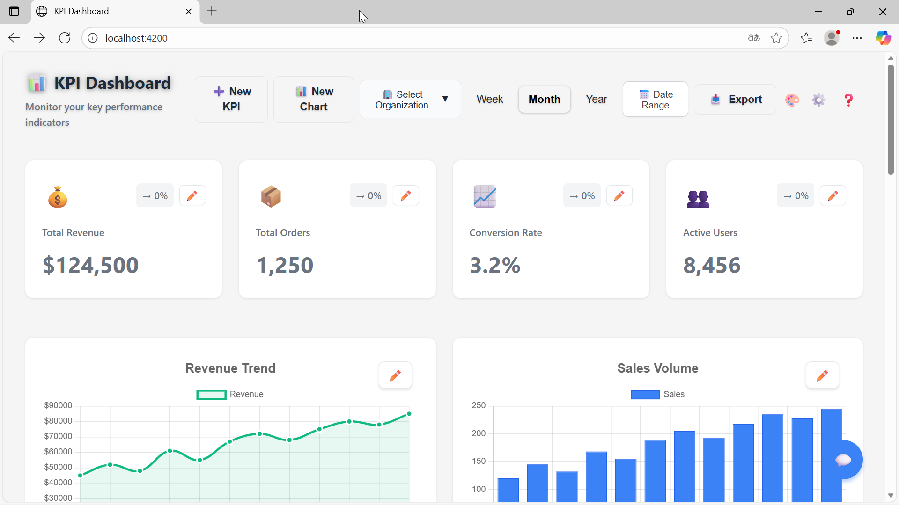

# KPI Dashboard 📊



A modern, feature-rich KPI (Key Performance Indicator) dashboard built with Angular 17.

## ✨ Key Features

### **Core Dashboard:**
- 📊 **KPI Cards** - Animated counters with trend indicators
- 📈 **Interactive Charts** - Line, bar, pie charts with drill-down
- 📅 **Date Range Picker** - Custom date selection with presets
- 📥 **Export Data** - CSV, Excel, and PDF formats
- 🎯 **Goal Tracking** - Visual progress bars for targets
- 🤖 **AI Insights** - Automated trend analysis & anomaly detection
- 🔬 **Advanced Analytics** ⭐ - Forecasting, Cohort, Funnel, A/B Testing, Statistical Tests
- 🧮 **Calculated Metrics** ⭐ NEW - Custom KPI formulas, aggregations, running totals (Full UI)

### **Enterprise Features:**
- 🔐 **OAuth Integration** - Google & GitHub login
- 🔒 **Two-Factor Auth** - TOTP with QR codes
- 👥 **Multi-User Roles** - Admin, Editor, Viewer permissions
- 📧 **Scheduled Reports** ✨ - Automated cron jobs with branded emails
- 🎨 **White-Label Branding** ✨ - Logo, colors, fonts, custom CSS (Full UI)
- 🏢 **Multi-Tenancy** ⭐ NEW - Complete tenant isolation & data segregation (Full UI)
- 🔐 **Advanced User Mgmt** ⭐ NEW - LDAP/AD, SCIM, SAML SSO (Full UI)
- ⏰ **Temporary Access** ⭐ NEW - Time-limited resource permissions (Full UI)
- 📋 **Audit Trail** ⭐ NEW - Comprehensive activity logging (Full UI)
- 🔄 **Version Control** ⭐ NEW - Save versions, rollback, change history (Full UI)
- 🔌 **Multiple Data Sources** ⭐ NEW - 13 connectors: DB, API, Cloud, SaaS (Full UI)
- ⚙️ **ETL Pipeline** ⭐ NEW - Extract, Transform, Load with validation & scheduling (Full UI)
- 🎯 **Dashboard Builder** - Drag-and-drop grid customization
- 📐 **Templates** - 4 pre-built dashboard layouts

### **Advanced:**
- 📱 **PWA Support** - Install as app, works offline
- ♿ **Accessibility** - WCAG compliant, keyboard navigation
- ⚡ **Performance** - Optimized caching, lazy loading
- 🔌 **WebSocket Ready** - Real-time updates foundation
- 🧪 **Well Tested** - 119+ unit tests

> **See [COMPLETE-FEATURES-LIST.md](COMPLETE-FEATURES-LIST.md) for full feature list**

## Demo Features

- 📊 **KPI Cards** with animated trend indicators
- 📈 **Interactive Charts** for revenue, sales, and conversion
- 🎨 **Modern UI** that adapts to light/dark mode
- ⏱️ **Period Selection** to filter by week, month, or year
- 📤 **Data Management** via secure admin panel

## Prerequisites

- Node.js (v18 or higher)
- npm (v9 or higher)

## Installation

1. Install dependencies:
```bash
npm install
```

## Development

### Start Dashboard

Run the development server:
```bash
npm start
```

Navigate to `http://localhost:4200/` to view the dashboard.

### Start All Services (Recommended)

For full functionality including scheduled reports:
```bash
npm run start:all
```

This starts:
- Dashboard (port 4200)
- File Upload Server (port 3001)
- Email Service (port 3002)
- OAuth Service (port 3003)
- LDAP Service (port 3004)
- SCIM Service (port 3005)
- SAML Service (port 3006)

## Build

Build for production:
```bash
npm run build
```

The build artifacts will be stored in the `dist/` directory.

## Project Structure

```
src/
├── app/
│   ├── components/
│   │   ├── dashboard/          # Main dashboard component
│   │   ├── kpi-card/           # KPI card component
│   │   ├── revenue-chart/       # Revenue chart component
│   │   ├── sales-chart/         # Sales chart component
│   │   └── conversion-chart/    # Conversion chart component
│   ├── services/
│   │   └── data.service.ts      # Data service with mock data
│   ├── app.module.ts            # Root module
│   ├── app-routing.module.ts    # Routing configuration
│   └── app.component.*          # Root component
├── styles.css                   # Global styles
└── index.html                   # Entry HTML file
```

## Technologies Used

- Angular 17
- Chart.js (via ng2-charts)
- TypeScript
- CSS3

## Admin Panel

### Accessing Admin

1. Click "⚙️ Admin" button in the dashboard
2. Login with password: `admin123` (default)
3. Upload new dashboard data via JSON file

### Security Features

- ✅ Password authentication
- ✅ File size validation (max 1MB)
- ✅ Rate limiting (5 uploads/minute)
- ✅ File type validation (JSON only)

**Important:** Change the default password in `src/app/services/auth.service.ts` for production!

### New: Enterprise Features ⭐

All features now have **comprehensive management UIs** accessible from the Admin Panel:

#### **Data & Analytics:**
- **🔌 Data Sources** (`/data-sources`) - Manage 13 data connectors (DB, API, Cloud, SaaS)
- **⚙️ ETL Jobs** (`/etl-jobs`) - Extract, Transform, Load pipeline management
- **🔬 Advanced Analytics** (`/analytics`) - Forecasting, Cohort, Funnel, A/B Testing

#### **Security & Governance:**
- **📋 Audit Trail** (`/audit-trail`) - Comprehensive activity logging with filters
- **🏢 Tenants** (`/tenants`) - Multi-tenancy management with tenant isolation
- **⏰ Temp Access** (`/temp-access`) - Time-limited resource permissions

#### **Customization & Reporting:**
- **🎨 Branding** (`/branding`) - Logo, colors, fonts, custom CSS
- **📧 Email Scheduler** (`/email-scheduler`) - Automated scheduled reports
- **👥 Users** (`/users`) - Advanced user management
- **🔐 2FA Setup** (`/2fa-setup`) - Two-factor authentication

#### **Dashboard Management:**
- **🔄 Version History** (`/version-history`) - Save, rollback, compare versions
- **🎯 Dashboard Builder** (`/builder`) - Drag-and-drop grid customization

**Quick Access:** Login at `/login` (password: `admin123`), then navigate to `/admin` to access all features.

**Documentation:**
- [Scheduled Reports & Branding Guide](SCHEDULED-REPORTS-BRANDING-GUIDE.md)
- [Multi-Tenancy & Advanced User Management Guide](MULTI-TENANCY-ADVANCED-USER-MANAGEMENT-GUIDE.md)
- [Dashboard Version Control Guide](DASHBOARD-VERSION-CONTROL-GUIDE.md)
- [Multiple Data Sources Guide](MULTIPLE-DATA-SOURCES-GUIDE.md)
- [ETL Pipeline Guide](ETL-PIPELINE-GUIDE.md)
- [Advanced Analytics Guide](ADVANCED-ANALYTICS-GUIDE.md)
- [Calculated Metrics Guide](CALCULATED-METRICS-GUIDE.md)

## Customization

### Option 1: Edit JSON File
1. Start the backend: `npm run start:server`
2. Access admin panel: http://localhost:4200/admin
3. Download current data
4. Edit and upload the modified file

### Option 2: Connect to Real API
Update `src/app/services/data.service.ts` to fetch from your backend API

## License

MIT

---

## 💼 Professional Services

Would you like to create feature-rich services & apps in short time without expensive developers working on it for weeks and months? Let me help you. I live in Hamburg.

### 📞 Contact Me

**Germany:** +49 1520 464 14 73  
**Italy:** +39 345 345 0098  
**Email:** mario.muja@gmail.com

I am looking forward to hearing from you!

---
